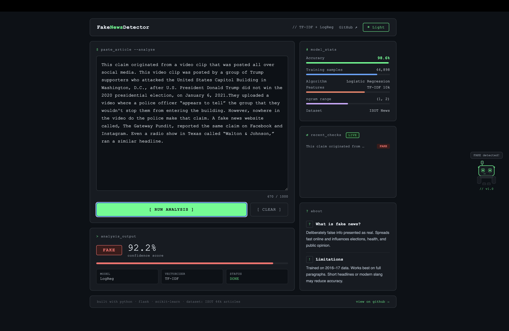
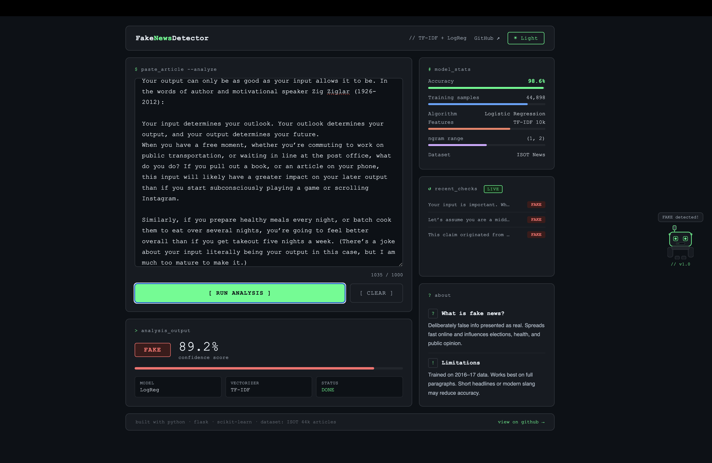

# FakeNewsDetector 🤖

A machine learning web app that detects whether a news article is **real or fake** with a confidence score — built with Python, Flask, and scikit-learn.




## 🚀 Live Demo
[Click here to try it live](https://fake-news-detector-aih4.onrender.com)

---

## ✨ Features

- 🔍 Paste any news article or headline and get an instant verdict
- 📊 Confidence score with animated progress bar
- 🕓 Recent checks history — tracks your last 5 analyses live
- 🤖 Floating robot mascot that reacts to results
- 🌗 Dark / Light mode toggle
- 📈 Model stats panel — accuracy, training samples, features

---

## 🧠 How It Works

1. User pastes a news article into the terminal-style input
2. Text is sent to the Flask backend via a POST request
3. The text is vectorized using **TF-IDF** (10,000 features, bigrams)
4. A trained **Logistic Regression** model predicts Real or Fake
5. Confidence score and verdict are returned and animated on screen

---

## 📊 Model Performance

| Metric | Value |
|--------|-------|
| Accuracy | 98.6% |
| Algorithm | Logistic Regression |
| Vectorizer | TF-IDF (10k features) |
| ngram range | (1, 2) |
| Training samples | 44,898 |
| Dataset | ISOT Fake News Dataset |

---

## 🛠 Tech Stack

**Backend**
- Python 3.x
- Flask
- scikit-learn
- pandas
- pickle

**Frontend**
- HTML5, CSS3, JavaScript (Vanilla)
- CSS animations & transitions
- Responsive two-column layout

---

## 📁 Project Structure
Fake-News-Detector/
│
├── app.py                  # Flask backend & API routes
├── train.py                # ML model training script
├── requirements.txt        # Python dependencies
├── README.md
├── .gitignore
│
├── data/
│   ├── Fake.csv            # Download from Kaggle (not in repo)
│   └── True.csv            # Download from Kaggle (not in repo)
│
├── models/
│   ├── model.pkl           # Trained model (generated)
│   └── vectorizer.pkl      # TF-IDF vectorizer (generated)
│
├── templates/
│   └── index.html          # Main UI
│
├── static/
│   ├── style.css           # All styles + dark/light mode
│   └── script.js           # Animations, API calls, history
│
└── screenshots/
└── demo1.png               # UI screenshot 1
└── demo2.png               # UI screenshot 2

---

## ⚙️ Run Locally

**1. Clone the repo**
```bash
git clone https://github.com/kay7k4-ai/Fake-News-Detector.git
cd Fake-News-Detector
```

**2. Install dependencies**
```bash
pip install -r requirements.txt
```

**3. Download the dataset**

Download [ISOT Fake News Dataset](https://www.kaggle.com/datasets/clmentbisaillon/fake-and-real-news-dataset) from Kaggle and place `Fake.csv` and `True.csv` inside the `data/` folder.

**4. Train the model**
```bash
python train.py
```
This generates `model.pkl` and `vectorizer.pkl` inside `models/`.

**5. Run the app**
```bash
python app.py
```

Open your browser at `http://127.0.0.1:5000`

---

## ⚠️ Known Limitations

- Trained on **2016–2017 news data** (ISOT dataset) — may not reflect modern writing styles
- Works best on **full paragraphs** rather than short headlines
- Not suitable for non-English text
- Confidence score reflects model certainty, not absolute truth

---

## 🚀 Deployment

This app is deployed on [Render](https://render.com) (free tier).

To deploy your own:
1. Push code to GitHub
2. Go to [render.com](https://render.com) → New Web Service
3. Connect your GitHub repo
4. Set:
   - **Build command:** `pip install -r requirements.txt`
   - **Start command:** `python app.py`
5. Done — you get a live URL!

---

## 📜 License

MIT License — feel free to use and modify.

---

## 🙋‍♀️ Author

Made by **Karima** · [GitHub](https://github.com/kay7k4-ai)